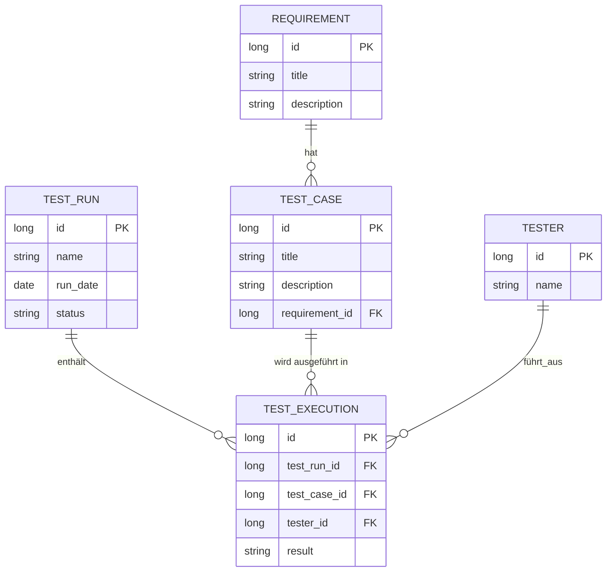
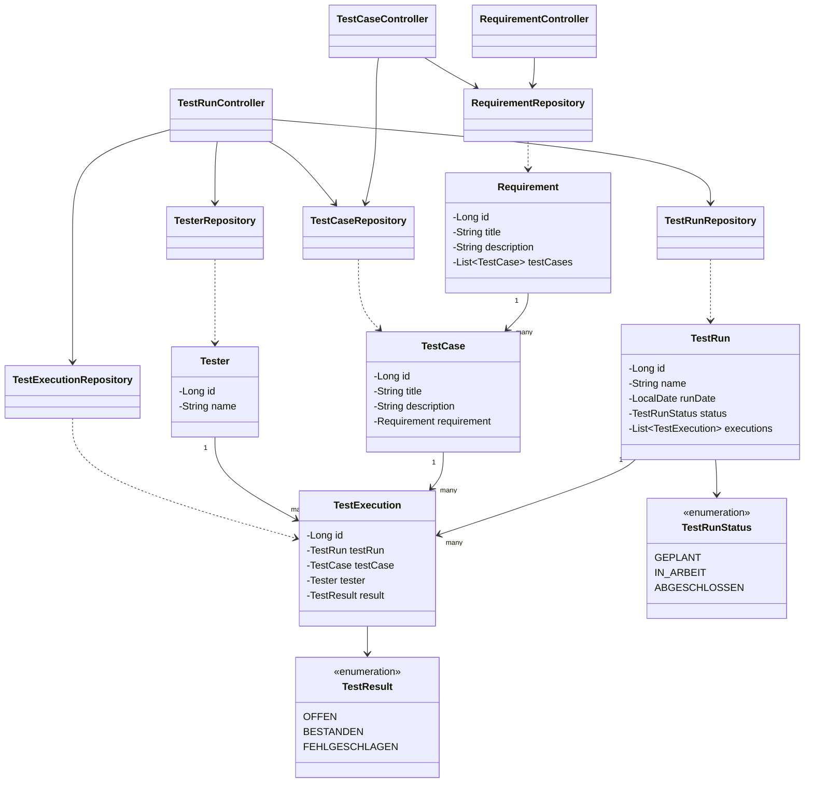

# Require4Testing

Uni-Projekt (Requirements Engineering). Kleine Web-App zum Organisieren von
manuellen Tests: Anforderungen anlegen, dazu Testfälle, Testläufe planen,
im Testlauf Testfälle + Tester:in zuordnen und Ergebnis eintragen.

Umgesetzte User Stories aus dem Backlog (Sprint 1):

1. Requirements Engineer legt Anforderungen an
2. Testmanager:in legt Testläufe an
3. Testfallersteller:in legt Testfälle zu einer Anforderung an
4. Testmanager:in ordnet Testlauf Testfälle + Tester:in zu
5. Tester:in trägt Ergebnis zu zugeordnetem Testfall ein

Reiner Prototyp - kein Login, kein schickes Design, Hauptsache es
funktioniert.

## Stack

- Java 17
- Spring Boot (Spring MVC, Controller/Repositories als Beans)
- Thymeleaf für die Views
- Spring Data JPA + Hibernate
- H2, Dateimodus (kein extra DB-Server nötig)
- Bootstrap 5 per CDN

Laut Aufgabenstellung wäre auch JSF + CDI möglich gewesen, wir haben uns
für die im Skript genannte Alternative Spring Boot entschieden.

## Starten

Java 17 vorausgesetzt. Maven-Wrapper ist dabei, also reicht:

```bash
./mvnw spring-boot:run
```

Dann `http://localhost:8080` öffnen (leitet automatisch auf die
Anforderungen weiter).

Die DB liegt als Datei unter `data/` und wird beim ersten Start mit ein
paar Beispieldaten befüllt (`src/main/resources/data.sql`). Für einen
sauberen Neustart einfach den `data/`-Ordner löschen.

H2-Konsole zum Reinschauen: `http://localhost:8080/h2-console` (JDBC-URL
steht in `application.properties`).

## Seiten

```
/                -> redirect auf /requirements
/requirements    Übersicht + neue Anforderung anlegen
/testcases       Übersicht + neuen Testfall anlegen (mit Requirement-Auswahl)
/testruns        Übersicht + neuen Testlauf anlegen
/testruns/{id}   Testfälle + Tester zuordnen, Ergebnis setzen
```

Navigation läuft über die Navbar oben (immer sichtbar). Von der
Testlauf-Übersicht kommt man über "Details" auf die Detailseite, von dort
per Link zurück.

Mehr Details (Wireframes, Screenshots, DB- und Architektur-Erklärung) in
[docs/Entwicklungsdokumentation.md](docs/Entwicklungsdokumentation.md).

## Datenmodell

Anforderung hat mehrere Testfälle. Ein Testlauf enthält mehrere
"Testdurchführungen" (`test_execution`) - Zwischentabelle zwischen
Testlauf und Testfall, zusätzlich mit Tester:in und Ergebnis.



## Architektur

Kein extra Service-Layer, Controller reden direkt mit den Repositories -
für den Prototyp reicht das.

- `model` - Entities (`Requirement`, `TestCase`, `TestRun`, `Tester`,
  `TestExecution`) + Enums `TestRunStatus`, `TestResult`
- `repository` - je Entity ein Spring-Data-JPA-Repository
- `controller` - nehmen Requests entgegen, holen/speichern über
  Repositories, wählen das Thymeleaf-Template



Controller/Repositories sind normale Spring Beans, per Konstruktor
verdrahtet (kein `@Autowired` nötig bei nur einem Konstruktor).

## Was fehlt (bewusst)

- Login/Rollen
- Validierung mit Fehlermeldungen im Formular
- Bearbeiten/Löschen (aktuell nur Anlegen + Ergebnis ändern)
- Tests

Entspricht den übrigen, noch nicht umgesetzten Stories aus dem Backlog
(Übersichten für Tester:innen/Testmanager:innen, einzelne Testschritte).
