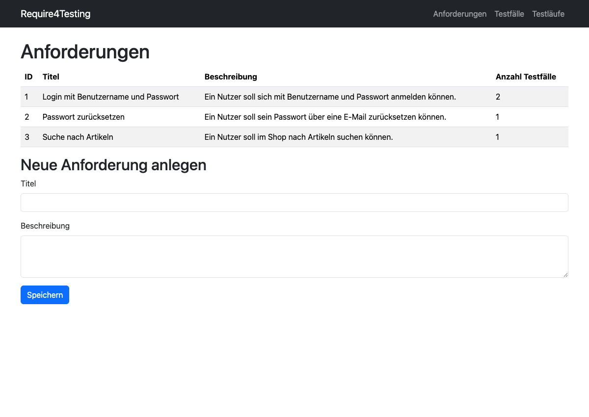
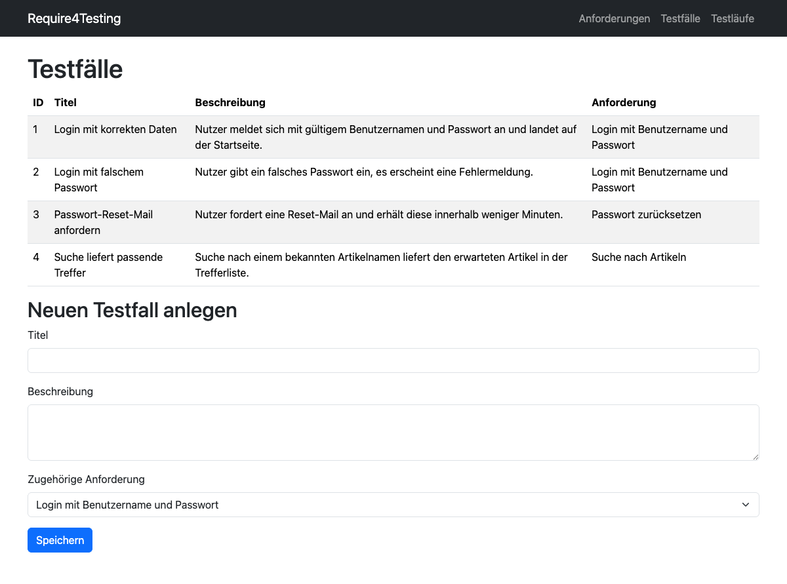
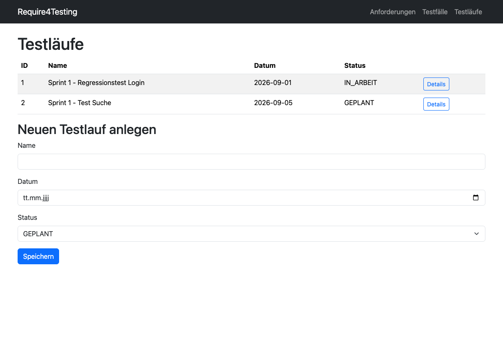
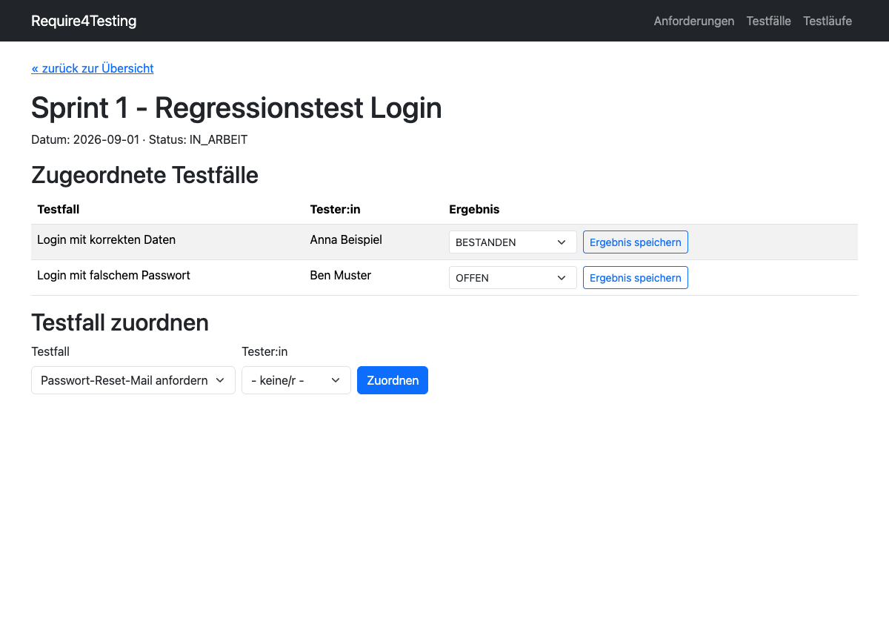
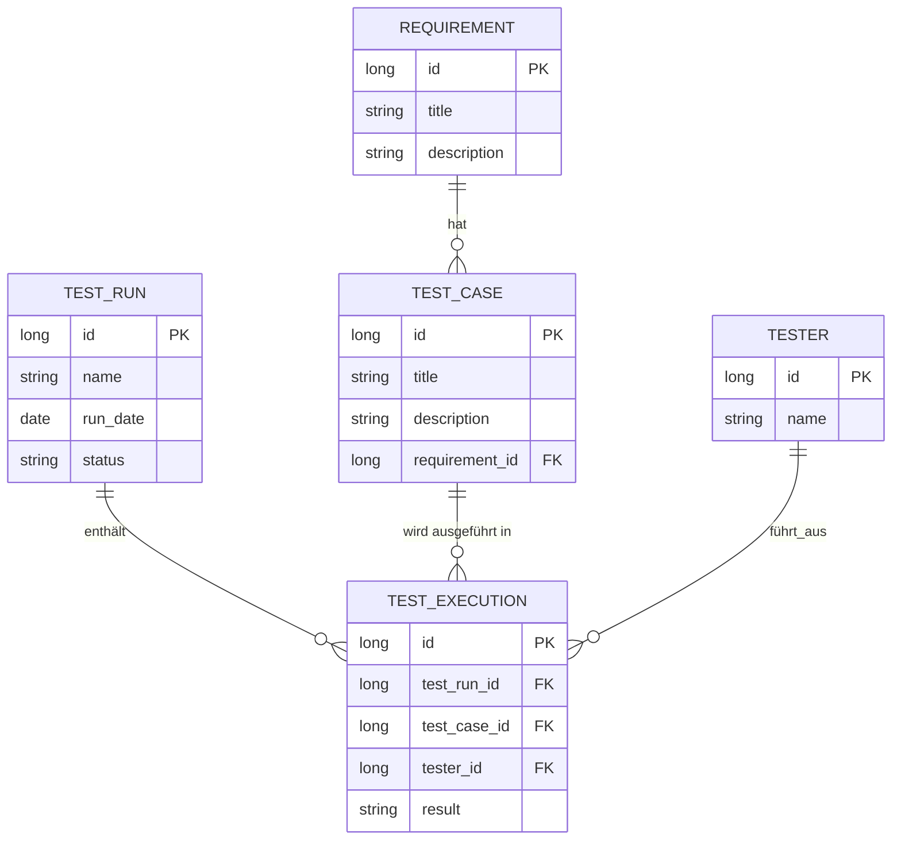
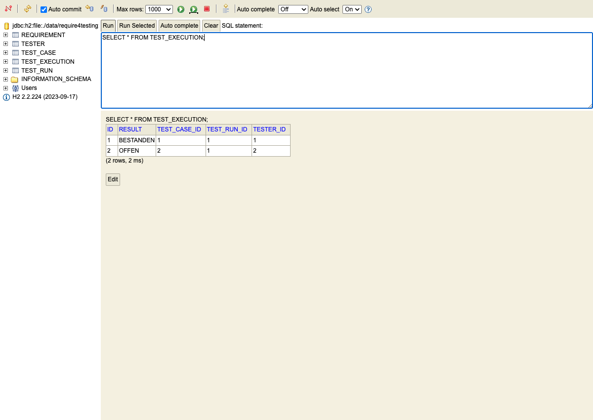
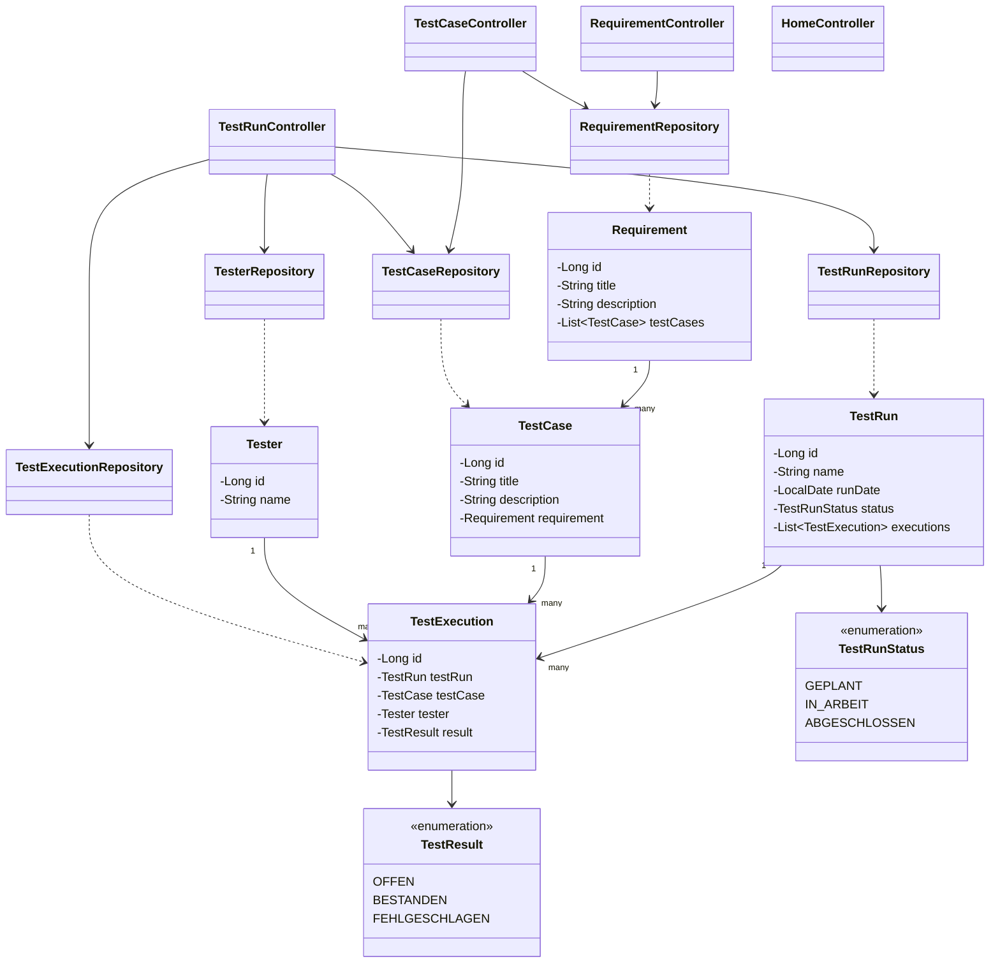

# Entwicklungsdokumentation Require4Testing

Design und Umsetzung des Prototyps aus Sprint 1 (die 5 User Stories stehen
in der [README](../README.md)). Zu jedem Punkt erst der Entwurf, dann wie
es tatsächlich geworden ist, mit Screenshot aus der laufenden App.

## 1. Webseiten und Navigation

Sitemap, wie sie am Anfang skizziert wurde:

```mermaid
graph LR
    A[Start "/"] -->|redirect| B[Anforderungen]
    B <-->|Navbar| C[Testfälle]
    C <-->|Navbar| D[Testläufe]
    D <-->|Navbar| B
    D -->|Button Details| E[Testlauf-Detail]
    E -->|Link zurück| D
```

Navbar oben ist immer da, damit man zwischen den drei Bereichen
(Anforderungen, Testfälle, Testläufe) wechseln kann. Einziger Extra-Sprung:
von der Testlauf-Übersicht über "Details" auf die Detailseite.

Für jede Seite gab's vorher ein grobes Wireframe (nur Kästen, kein
Design), damit klar war was drauf muss.

### Anforderungen

```
+------------------------------------------------------------+
| Require4Testing        Anforderungen  Testfälle  Testläufe |
+------------------------------------------------------------+
|  Anforderungen                                              |
|  ID | Titel | Beschreibung | # Testfälle                    |
|  1  | ...   | ...          | 2                              |
|                                                              |
|  Neue Anforderung anlegen                                   |
|  Titel        [______________________]                      |
|  Beschreibung [______________________]                      |
|               [ Speichern ]                                 |
+------------------------------------------------------------+
```

Liste oben, Formular direkt drunter - kein Umweg über eine extra
"Neu"-Seite.

`/requirements`:



### Testfälle

```
+------------------------------------------------------------+
|  Testfälle                                                   |
|  ID | Titel | Beschreibung | Anforderung                    |
|  1  | ...   | ...          | Login mit Benutzername...      |
|                                                              |
|  Neuen Testfall anlegen                                     |
|  Titel        [______________________]                      |
|  Beschreibung [______________________]                      |
|  Anforderung  [ Dropdown v ]                                 |
|               [ Speichern ]                                  |
+------------------------------------------------------------+
```

Gleiches Prinzip, nur mit Dropdown für die zugehörige Anforderung
(Pflichtfeld).

`/testcases`:



### Testläufe

```
+------------------------------------------------------------+
|  Testläufe                                                   |
|  ID | Name | Datum | Status |                               |
|  1  | ...  | ...   | ...    | [Details]                     |
|                                                              |
|  Neuen Testlauf anlegen                                     |
|  Name  [______________________]                              |
|  Datum [__.__.____]                                          |
|  Status [ Dropdown v ]                                       |
|         [ Speichern ]                                        |
+------------------------------------------------------------+
```

`/testruns`:



### Testlauf-Detail

```
+------------------------------------------------------------+
| « zurück zur Übersicht                                       |
|  <Name>  -  Datum: ...  Status: ...                          |
|                                                              |
|  Zugeordnete Testfälle                                       |
|  Testfall | Tester:in | Ergebnis                             |
|  ...      | ...       | [Dropdown v] [Speichern]             |
|                                                              |
|  Testfall zuordnen                                            |
|  Testfall [Dropdown v]  Tester:in [Dropdown v]  [Zuordnen]    |
+------------------------------------------------------------+
```

Wichtigste Seite - hier laufen Story 4 (zuordnen) und Story 5 (Ergebnis
eintragen) zusammen. Jede Zeile hat ihr eigenes kleines Formular fürs
Ergebnis, damit man nicht auf eine andere Seite muss.

`/testruns/1`:



## 2. Datenbankstruktur

Fünf Tabellen. Anforderung -> Testfälle (1:n). `test_execution` ist die
Zwischentabelle zwischen Testlauf und Testfall, mit Tester und Ergebnis
als Zusatzspalten.



Umgesetzt über JPA-Annotationen (`@Entity`, `@OneToMany`/`@ManyToOne`,
`@JoinColumn`). Hibernate erzeugt die Tabellen beim Start selbst
(`ddl-auto=update`), Tabellennamen kommen aus den Klassennamen -
`TestCase` wird `test_case`.

Screenshot aus der H2-Konsole: links die 5 Tabellen, rechts eine Abfrage
auf `test_execution` - man sieht die Fremdschlüssel-Spalten und die zwei
Beispiel-Durchführungen:



## 3. Architektur

Kein Service-Layer, Controller reden direkt mit den Repositories.



Bean-Typen kurz:
- Controller (`@Controller`): HomeController, RequirementController, TestCaseController, TestRunController
- Repositories (Spring Data, `extends JpaRepository`): je Entity eins
- Entities (`@Entity`): kein Spring Bean, aber die Kernklassen im Datenmodell

Paketstruktur entspricht dem Diagramm 1:1:

```
src/main/java/com/example/require4testing/
├── Require4TestingApplication.java
├── controller/
│   ├── HomeController.java
│   ├── RequirementController.java
│   ├── TestCaseController.java
│   └── TestRunController.java
├── model/
│   ├── Requirement.java
│   ├── TestCase.java
│   ├── TestRun.java
│   ├── TestRunStatus.java   (Enum)
│   ├── Tester.java
│   ├── TestExecution.java
│   └── TestResult.java      (Enum)
└── repository/
    ├── RequirementRepository.java
    ├── TestCaseRepository.java
    ├── TesterRepository.java
    ├── TestRunRepository.java
    └── TestExecutionRepository.java
```

Repositories werden per Konstruktor in die Controller injiziert, z.B.
`TestRunController`:

```java
public TestRunController(TestRunRepository testRunRepository,
                          TestCaseRepository testCaseRepository,
                          TesterRepository testerRepository,
                          TestExecutionRepository testExecutionRepository) {
    this.testRunRepository = testRunRepository;
    this.testCaseRepository = testCaseRepository;
    this.testerRepository = testerRepository;
    this.testExecutionRepository = testExecutionRepository;
}
```

Views liegen passend zu den Controllern in `src/main/resources/templates/`
(`requirements/`, `testcases/`, `testruns/`), Navbar als gemeinsames
Fragment in `fragments/navbar.html`.
